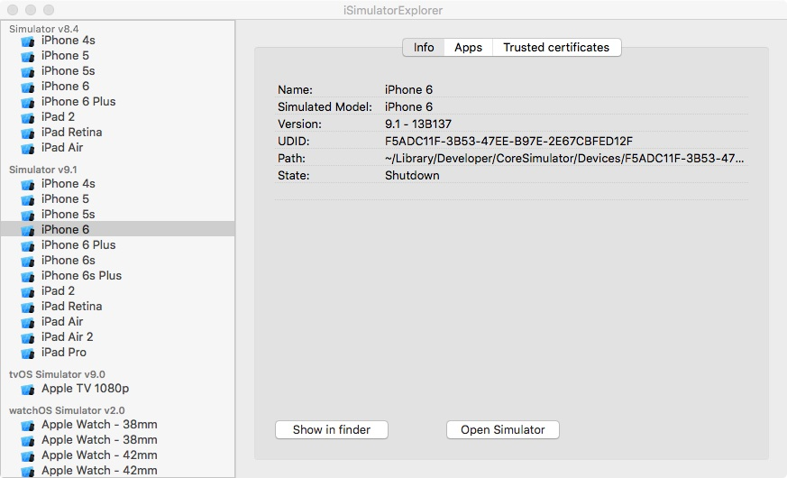

### What is iSimulatorExplorer? ###

iSimulatorExplorer is a simple OS X application written in Swift to browse the available iOS Simulators on your system. It provides the following functions:

* View informations and status on each available iOS simulator.

* Launch the iOS simulator

* Quickly open applications program and data folder in Finder.

* Add/remove/import/export CA certificate on iOS Simulators. This make it easy to test applications connecting to development server with self-signed certificates or using a man-in-the-middle proxy like mitmproxy where you need to install the proxy CA in the simulator.

* Install/Uninstall Apps in iOS simulator.

### System requirements ###

* OS X 10.10 or above
* Xcode 6.0 or above
* Xcode 8 to build the current version of the project.

### Notes on CA certificates in iOS simulator ###

* The trusted certificate management in iOS simulator is based on the [ADVTrustStore project](https://github.com/ADVTOOLS/ADVTrustStore) I have written 2 years ago.

* To make it easy to test certificate imported with this tool, a sample iOS application is provided in this project: TestTrustedCertificate. It consist of a simple WebView to test a SSL connection to a server.

### Copyright and license ###

Copyright (c) 2015-2016, Daniel Cerutti. Licensed under the MIT license. See LICENSE file in this project.
